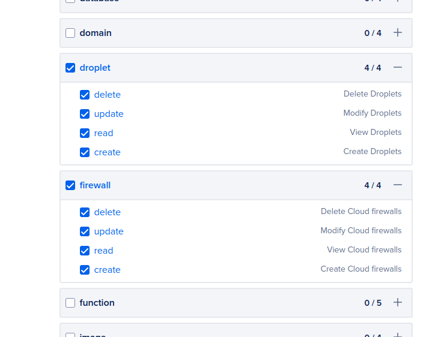

# Veilid Terraform

details at https://veilid.com/

Running veilid nodes is super cool, and I wanted an easy way to do it across multiple regions in Digital Ocean, so depending on your appetite, you can spawn a bunch of these all over the place if you want.

## Cost

Each of the droplets here costs about $4/month, and since Digital Ocean doesn't charge extra for IPv4 addresses in use, the default configuration is running dual-stack (IPv4/IPv6).

## Running the commands

1. grab an access token at https://cloud.digitalocean.com/account/api/tokens, and then copy `.env.example` to `.env` and add the value of the token there.

For scopes, select "Custom Scopes" and give it all access for the Droplets and Firewalls API (see screenshot below):



2. Add your public SSH key to the cloud-init script, in `setup-veilid.yaml` inside the ` ssh_authorized_keys:` block

3. Decide which region(s) you want to run a veilid node in, and uncomment the relevant line(s) in the `locals.regions` block in `main.tf`. As mentioned, not all regions support the smalles droplet size currently selected.

4. Add your public ssh key in the `ssh_authorized_keys` section in `setup-veilid.yaml`. If you don't care about SSH access, just skip this step.

> If you want to use a separate SSH key, then generate one in this folder like `ssh-keygen -t ed25519 -o -a 100 -f veilid-key`. Then, make sure to update `setup-veilid.yaml` with the key contents.

5. then you can run `terraform init && terraform apply` and get a/some shiny new node(s)!

You'll see the IP addresses to connect to in the output of the above command:

```sh
Outputs:

public_ipv4 = [
  "146.190.108.112",
  "170.64.227.40",
]
public_ipv6 = [
  "2400:6180:0:d0::3ed:e001",
  "2400:6180:10:200::d0:b000",
]
```

> NOTE: since the cloud init script takes a bit of time to run, if you SSH in immediately, you might not have access to the `veilid-cli` command for a few minutes.
